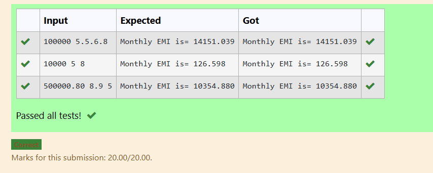
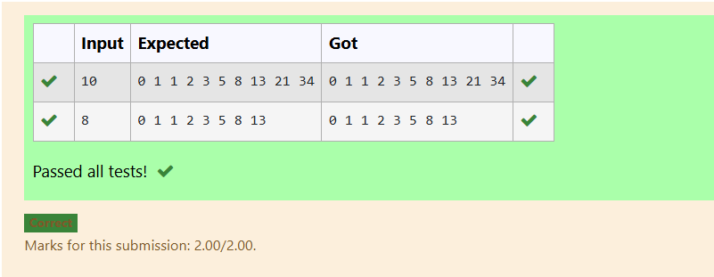
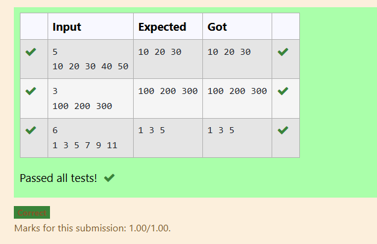
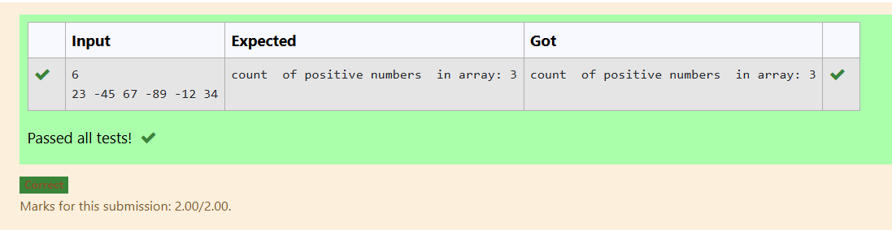
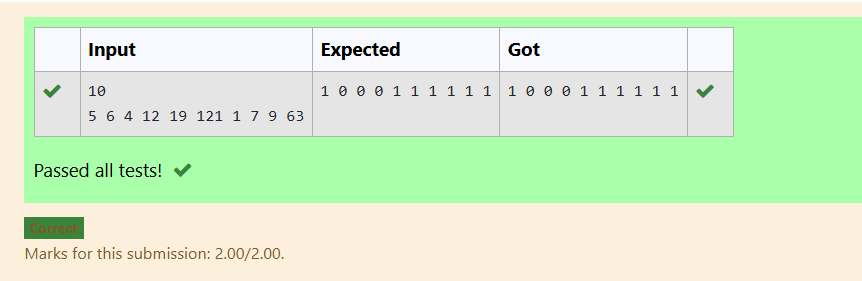

## Name: VANATHI T
## Reg no.:25013590

# EX-11-EMI-CALCULATOR

## AIM:

To write a program to prepare EMI calculator using function without return type and with arguments.

## ALGORITHM

1.	Start the program.
2.	Read principal amount, rate of interest and months.
3.	Pass these values as arguments to function.
4.	Calculate EMI using the formula, amt=(prpow(1+r,t))/(pow(1+r,t)-1)
5.	Display the result.
6.	Stop the program.

## PROGRAM
```
#include <stdio.h>
#include<math.h>
void emi();
int main()
{
      emi();
}
void emi()
{
    float a,r,t,e,n,i;
    scanf("%f %f %f",&a,&r,&t);
    n= t*12;
    i=r/(12*100.0);
    e=(a*i*pow(1+i,n))/(pow(1+i,n)-1);
    printf("Monthly EMI is= %.3f",e);
}
```

## OUTPUT



## RESULT

Thus the program to prepare EMI calculator using function without return type with arguments has been executed successfully
 
# EX-12-FIBONACCI-SERIES
## AIM
To write a C program to generate the Fibonacci series for the given value.

## ALGORITHM


1. Declare integer variables n, fir = 0, sec = 1, next, and count = 0.

2. Read the value of n from the user using scanf().

3. Repeat the following steps using a do-while loop while count < n:

4. If count <= 1, set next = count.

5. Otherwise, calculate next = fir + sec, then update fir = sec and sec = next.

6. Print the value of next.

7. Increment count by 1.

8. After the loop ends, print a newline.

9. Stop the program.

## PROGRAM
```
#include<stdio.h>
int main(){
    int n,fir=0,sec=1,next,count=0;
    scanf("%d",&n);
    do
    {
        if(count<=1)
        {
            next = count;
        }
        else{
            next = fir+sec;
            fir=sec;
            sec=next;
        }
        printf("%d ",next);
        count++;
    } while(count<n);
    printf("\n");
    return 0;
}

```
## OUTPUT




## RESULT
Thus, the program to generate the Fibonacci series up to ‘n’ terms has been executed successfully. 
 


# EX-13-ONE-DIMENSIONAL-ARRAY
## AIM
To write a C program to read n elements as input and print the first three elements of an array


## ALGORITHM
1.	Start the program.
2.	Read a variable.
3.	Read the array values n number of times.
4.	Print the first three elements.
5.	Stop the program.

## PROGRAM
```

#include <stdio.h>

int main() {
    int n, i;
    
    
    scanf("%d", &n);

    int arr[n];
    

    for(i = 0; i < n; i++) {
        scanf("%d", &arr[i]);
    }

    
    for(i = 0; i < 3 && i < n; i++) {
        printf("%d ", arr[i]);
    }

    return 0;
}

```

## OUTPUT



## RESULT
Thus the program to read n elements as input and print the first three element of the array has been executed successfully.
 
 


# EX-14-POSITIVE-ARRAY-ELEMENTS
## AIM
To write a C Program to count total number of positive elements in an array.

## ALGORITHM
1.	Start the program.
2.	Read a variable.
3.	Read the array values n number of times.
4.	If the array value can be divided by 2 then increment count by 1.
5.	Display result.
6.	Stop the program.

## PROGRAM
```
#include <stdio.h>

int main() {
    int n, i, count = 0;
    
    // Read number of elements
    scanf("%d", &n);
    int arr[n];
    
    // Read array elements
    for(i = 0; i < n; i++) {
        scanf("%d", &arr[i]);
    }
    
    // Count positive elements
    for(i = 0; i < n; i++) {
        if(arr[i] > 0) {
            count++;
        }
    }
    
    printf("count  of positive numbers  in array: %d\n", count);
    
    return 0;
}

```

## OUTPUT




## RESULT
Thus the program to count total number of positive elements in an array has been executed successfully.


 
 


# EX -15 - Replace All Even Elements by 0 and odd by 1 in one dimensional array

## Aim:
To write a C program to replace all even elements by 0 and odd by 1 in one dimensional array

## Algorithm:

1. Declare an integer array arr[100] and variables n and i.

2. Read the value of n (number of elements) from the user.

3. Read n elements and store them in the array arr.

4. Repeat the following steps for each element arr[i] from i = 0 to n - 1:

5. If arr[i] is even (arr[i] % 2 == 0), then assign 0 to arr[i].

6. Otherwise, assign 1 to arr[i].

7. Print the updated array elements.


## Program:
```
#include<stdio.h>
int main(){
    int arr[100];
    int n,i;
    scanf("%d",&n);
    for(i=0;i<n;i++){
        scanf("%d",&arr[i]);
    }
    for(i=0;i<n;i++){
        if(arr[i]%2==0){
        arr[i]=0;}
        else{
        arr[i]=1;}
    }
    for(i=0;i<n;i++){
        printf("%d ",arr[i]);
    }
    return 0;
}
```

## Output:
 


## Result:

Thus, the program to replace even numbers with 0 and odd numbers with 1 in an array has been executed successfully.


